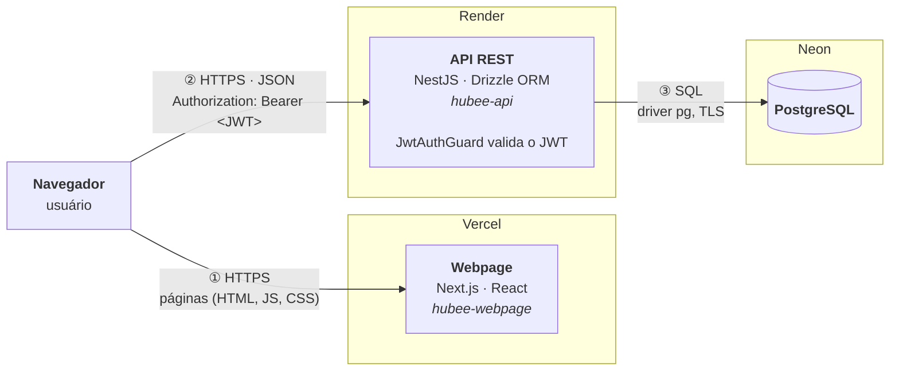

# Arquitetura do sistema

Visão geral de como as partes do Hubee se conectam: navegador, Webpage, API e
banco de dados. Os detalhes internos de cada módulo e o modelo do banco estão
fora desta página.



## Componentes

| Componente | Repositório | Tecnologia | Onde roda | Papel |
| --- | --- | --- | --- | --- |
| Navegador | — | — | Máquina do usuário | Exibe a interface e chama a API. |
| Webpage | `hubee-webpage` | Next.js, React | Vercel | Entrega as páginas (HTML, JS, CSS). |
| API | `hubee-api` | NestJS, Drizzle ORM | Render | Regras de negócio, validação e autenticação. |
| Banco de dados | — | PostgreSQL | Neon | Guarda os dados da plataforma. |

## Como uma requisição percorre o sistema

1. **Navegador → Webpage (HTTPS).** O navegador baixa as páginas da Vercel.
   A Webpage não acessa o banco e não guarda dados.
2. **Navegador → API (HTTPS, JSON).** O JavaScript que roda no navegador chama
   a API diretamente, com axios. A Webpage não faz papel de intermediária. Por
   isso o diagrama tem duas setas saindo do navegador.
3. **API → Banco (SQL).** A API consulta e grava no PostgreSQL pelo Drizzle,
   sobre o driver `pg`, com conexão TLS.

Só a API conhece as credenciais do banco. É por isso que existe uma API entre
o navegador e os dados: o navegador nunca recebe a senha do banco.

## Autenticação

A autenticação fica na API e usa token JWT:

1. `POST /auth/login` (ou `POST /auth/register`) devolve um `access_token`,
   assinado com `JWT_SECRET` e válido por um dia.
2. Nas rotas protegidas, o cliente envia o token no cabeçalho
   `Authorization: Bearer <access_token>`.
3. O `JwtAuthGuard` verifica a assinatura e a validade antes de executar a
   rota. Rotas restritas a administradores também passam pelo `RolesGuard`.

A API não guarda sessão: cada requisição traz o próprio token. Os contratos
completos estão em [Autenticação e cadastro](../backend/autenticacao.md).

:::note[Estado atual]

A Webpage ainda usa um login simulado (`/login`) e não envia o token para a
API. Hoje, só `/auth/me` e `/users/*` exigem token. A seta ② mostra o
cabeçalho que a API já espera nas rotas protegidas.

:::

## O que liga as partes

As peças se encontram por variáveis de ambiente, não por endereços fixos no
código:

| Variável | Onde | Para quê |
| --- | --- | --- |
| `NEXT_PUBLIC_API_URL` | Webpage | Endereço da API que o navegador chama. |
| `CORS_ORIGINS` | API | Domínios da Webpage autorizados a chamar a API pelo navegador. |
| `DB_HOST`, `DB_PORT`, `DB_USER`, `DB_PASSWORD`, `DB_NAME` | API | Conexão com o PostgreSQL. |
| `DB_SSL` | API | `true` no Neon, que exige TLS; `false` no Postgres local. |
| `JWT_SECRET` | API | Assina e verifica os tokens. |

Em desenvolvimento local, a mesma estrutura roda na sua máquina: a Webpage e a
API em `localhost` e o banco num container Docker. Veja
[O que você precisa fazer para começar](../primeiros-passos/intro.md).

## Editando o diagrama

O diagrama é escrito em [Mermaid](https://mermaid.js.org/), no bloco
` ```mermaid ` no topo deste arquivo. O site desenha o diagrama a partir desse
texto, então não há imagem para gerar: basta editar o bloco. Com `npm start`,
a alteração aparece na hora. O [Mermaid Live](https://mermaid.live) também
ajuda a testar mudanças maiores.

Atualize o diagrama sempre que um componente, provedor ou forma de comunicação
mudar.
